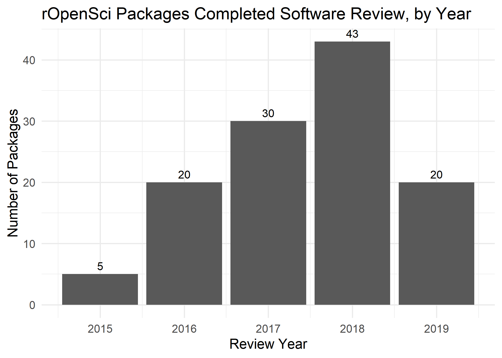
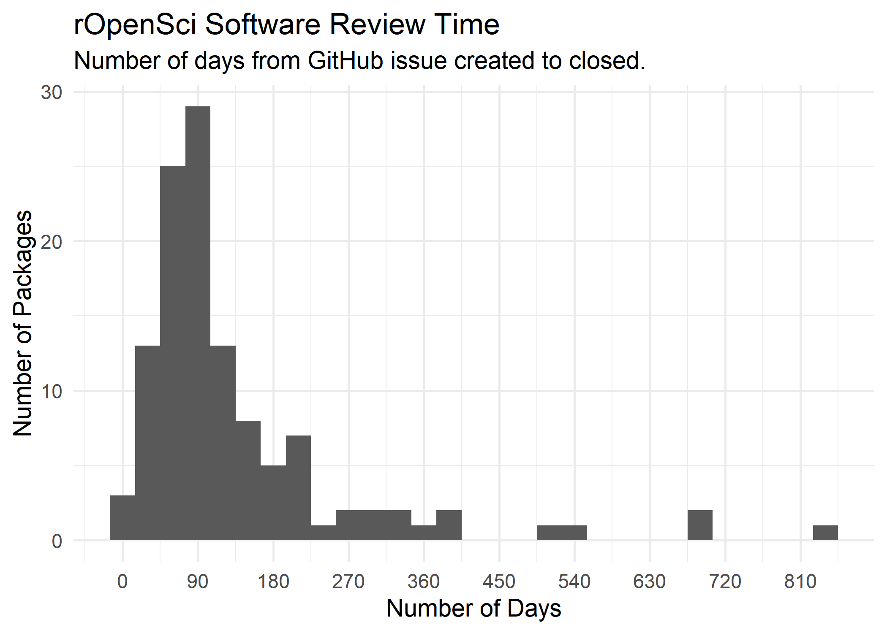

<!-- README.md is generated from README.Rmd. Please edit that file -->

# ropenscipackagesreviewed

This package contains a list of R packages in the rOpenSci registry and
metadata on whether they have gone through the rOpenSci software review
process (as of 2019-09-16).

## Installation

You can install the development version of ropenscipackagesreviewed
with:

``` r
# install.packages("devtools")
devtools::install_github("sharlagelfand/ropenscipackagesreviewed)
```

## Analysis

The list of packages is available internally, in
`ropenscipackagesreviewed::ropensci_packages`, or [in a
CSV](https://github.com/sharlagelfand/ropenscipackagesreviewed/blob/master/data-raw/ropensci_packages.csv).
The code to get the packages is [also
available](https://github.com/sharlagelfand/ropenscipackagesreviewed/blob/master/data-raw/ropensci_packages.R).

If a package had a GitHub issue onboarding URL in the registry, it is
considered to have gone through (or be going through) rOpenSci software
review. If the issue is closed, then I’m considering the review
“Completed” – if it’s still open, “In Progress”.

``` r
library(ropenscipackagesreviewed)

ropensci_packages
#> # A tibble: 406 x 5
#>    name        software_review review_status issue_created issue_closed
#>    <chr>       <lgl>           <chr>         <date>        <date>      
#>  1 auk         TRUE            Completed     2017-07-19    2018-08-26  
#>  2 genbankr    TRUE            Completed     2016-05-20    2016-08-03  
#>  3 treeio      TRUE            Completed     2018-01-03    2018-03-20  
#>  4 apipkgen    FALSE           <NA>          NA            NA          
#>  5 arresteddev FALSE           <NA>          NA            NA          
#>  6 aspacer     FALSE           <NA>          NA            NA          
#>  7 available   FALSE           <NA>          NA            NA          
#>  8 bindertools FALSE           <NA>          NA            NA          
#>  9 blogyaml    FALSE           <NA>          NA            NA          
#> 10 cchecks     FALSE           <NA>          NA            NA          
#> # ... with 396 more rows
```

``` r
library(dplyr)

n_ropensci_packages <- nrow(ropensci_packages)
ropensci_packages_review <- ropensci_packages %>%
  filter(software_review)
ropensci_packages_review_completed <- ropensci_packages_review %>%
  filter(review_status == "Completed")
ropensci_packages_review_in_progress <- ropensci_packages_review %>%
  filter(review_status == "In Progress")
ropensci_packages_no_review <- ropensci_packages %>%
  filter(!software_review)
```

Of the 406 packages in the rOpenSci registry, 30.0% (122) have gone
through review (118) or are still in review (4).

The following shows the number of packages that went through review each
year, where the GitHub issue closed date is when the review is
considered to be completed. Note that, of course, 2019 is not over yet\!

``` r
library(ggplot2)
#> Warning: package 'ggplot2' was built under R version 3.5.2
library(lubridate)

ropensci_packages_review_completed <- ropensci_packages_review_completed %>%
  mutate(review_year = year(issue_closed))

ropensci_packages_review_completed %>%
  count(review_year) %>%
  arrange(review_year) %>%
  ggplot(aes(x = review_year, y = n)) +
  geom_col() + 
  geom_text(aes(label = n, vjust = -0.5)) +
  labs(x = "Review Year",
       y = "Number of Packages",
       title = "rOpenSci Packages Completed Software Review, by Year") + 
  theme_minimal(14)
```



We can also look at how long it takes packages to go through review
(again, looking at the GitHub issue created/closed date as a proxy). The
following shows the distribution of days from issue created to closed:

``` r
ropensci_packages_review_completed <- ropensci_packages_review_completed %>%
  mutate(issue_created_to_closed = as.numeric(issue_closed - issue_created))

ggplot(ropensci_packages_review_completed,
       aes(x = issue_created_to_closed)) + 
  geom_histogram(binwidth = 30) + 
  scale_x_continuous(breaks = seq(0, max(ropensci_packages_review_completed[["issue_created_to_closed"]]), 90)) + 
  labs(x = "Number of Days",
       y = "Number of Packages",
       title = "rOpenSci Software Review Time",
       subtitle = "Number of days from GitHub issue created to closed.") + 
  theme_minimal(14)
```



``` r
issue_created_to_closed_summary <- summary(ropensci_packages_review_completed[["issue_created_to_closed"]])
```

Of all rOpenSci packages that have gone through software review, 50%
complete review within 92.5 days.

The following shows the median number of days it takes packages to go
through review, by review year, along with the number of packages (shown
above, but as a reminder\!).

``` r
library(knitr)
#> Warning: package 'knitr' was built under R version 3.5.3

ropensci_packages_review_completed %>%
  group_by(`Review Year` = review_year) %>%
  summarise(`Median Days from Issue Created to Closed` = median(issue_created_to_closed),
            `Number of Packages` = n()) %>%
  kable()
```

| Review Year | Median Days from Issue Created to Closed | Number of Packages |
| ----------: | ---------------------------------------: | -----------------: |
|        2015 |                                     42.0 |                  5 |
|        2016 |                                     72.5 |                 20 |
|        2017 |                                     99.5 |                 30 |
|        2018 |                                    104.0 |                 43 |
|        2019 |                                     97.5 |                 20 |
