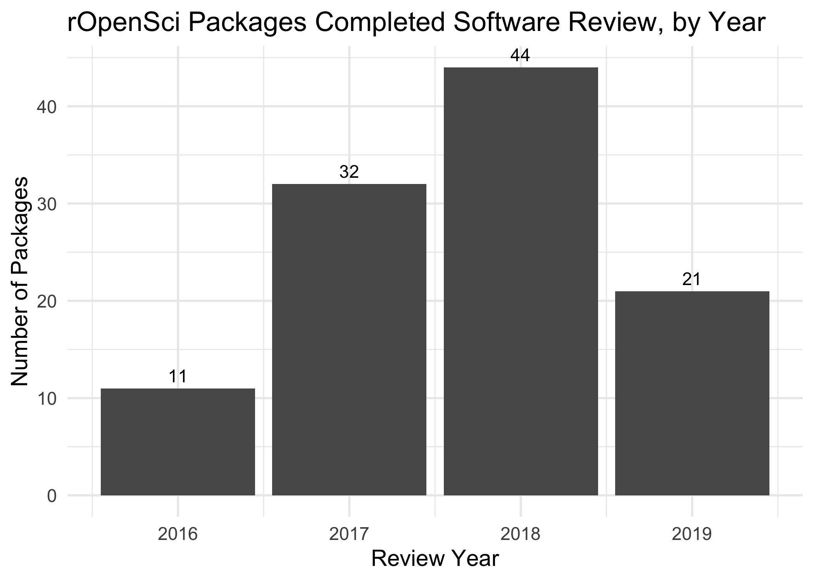

<!-- README.md is generated from README.Rmd. Please edit that file -->

# ropenscipackagesreviewed

This package contains a list of R packages in the [rOpenSci
registry](https://github.com/ropensci/roregistry/) and metadata on
whether they have gone through the rOpenSci software review process (as
of 2019-09-19).

## Installation

You can install the development version of ropenscipackagesreviewed
with:

``` r
# install.packages("devtools")
devtools::install_github("sharlagelfand/ropenscipackagesreviewed)
```

## Analysis

The list of packages is available internally, in
`ropenscipackagesreviewed::ropensci_packages`, or [in a
CSV](https://github.com/sharlagelfand/ropenscipackagesreviewed/blob/master/data-raw/ropensci_packages.csv).
The code to get the packages is [also
available](https://github.com/sharlagelfand/ropenscipackagesreviewed/blob/master/data-raw/ropensci_packages.R).

If a package had a GitHub issue onboarding URL in the registry, it is
considered to have gone through (or be going through) rOpenSci software
review. If the issue has the [“6/approved”
label](https://github.com/ropensci/software-review/issues?utf8=%E2%9C%93&q=is%3Aissue+label%3A6%2Fapproved+)
on it, then I’m considering the review to be “Completed” (regardless of
whether the issue is open or closed). If it doesn’t, then the review is
“In Progress”.

``` r
library(ropenscipackagesreviewed)

ropensci_packages
#> # A tibble: 406 x 7
#>    package software_review software_review… onboarding_url
#>    <chr>   <lgl>           <chr>            <chr>         
#>  1 auk     TRUE            Completed        https://githu…
#>  2 genban… TRUE            Completed        https://githu…
#>  3 treeio  TRUE            Completed        https://githu…
#>  4 apipkg… FALSE           <NA>             <NA>          
#>  5 arrest… FALSE           <NA>             <NA>          
#>  6 aspacer FALSE           <NA>             <NA>          
#>  7 availa… FALSE           <NA>             <NA>          
#>  8 binder… FALSE           <NA>             <NA>          
#>  9 blogya… FALSE           <NA>             <NA>          
#> 10 cchecks FALSE           <NA>             <NA>          
#> # … with 396 more rows, and 3 more variables: issue_created <dttm>,
#> #   review_completed <dttm>, issue_closed <dttm>
```

``` r
library(dplyr)

n_ropensci_packages <- nrow(ropensci_packages)
ropensci_packages_review <- ropensci_packages %>%
  filter(software_review)
ropensci_packages_review_completed <- ropensci_packages_review %>%
  filter(software_review_status == "Completed")
ropensci_packages_review_in_progress <- ropensci_packages_review %>%
  filter(software_review_status == "In Progress")
ropensci_packages_no_review <- ropensci_packages %>%
  filter(!software_review)
```

Of the 406 packages in the rOpenSci registry, 30.0% (122) have completed
review (108) or are still in review (14).

The following shows the number of packages that went through review each
year, using the date that the “6/approved” label was added to the issue.

``` r
library(ggplot2)
library(lubridate)

ropensci_packages_review_completed <- ropensci_packages_review_completed %>%
  mutate(review_year = year(review_completed))

ropensci_packages_review_completed %>%
  count(review_year) %>%
  arrange(review_year) %>%
  ggplot(aes(x = review_year, y = n)) +
  geom_col() +
  geom_text(aes(label = n, vjust = -0.5)) +
  labs(
    x = "Review Year",
    y = "Number of Packages",
    title = "rOpenSci Packages Completed Software Review, by Year"
  ) +
  theme_minimal(14)
```



We can also look at how long it takes packages to go through review. The
following shows the distribution of days from when the issue was created
to when the “6/approved” label was added to the
issue.

``` r
ropensci_packages_review_completed <- ropensci_packages_review_completed %>%
  mutate(issue_created_to_review_completed = as.numeric(review_completed - issue_created) / (60 * 60 * 24))

ggplot(
  ropensci_packages_review_completed,
  aes(x = issue_created_to_review_completed)
) +
  geom_histogram(binwidth = 30) +
  scale_x_continuous(breaks = seq(0, max(ropensci_packages_review_completed[["issue_created_to_review_completed"]]), 90)) +
  labs(
    x = "Number of Days",
    y = "Number of Packages",
    title = "rOpenSci Software Review Time",
    subtitle = "Number of days from GitHub issue created to package approved."
  ) +
  theme_minimal(14)
```


``` r
issue_created_to_review_completed_summary <- summary(ropensci_packages_review_completed[["issue_created_to_review_completed"]])
```

Of all rOpenSci packages that have gone through software review, 50%
complete review within 81.1 days.

The following shows the median number of days it takes packages to go
through review, by review year, along with the number of packages (shown
above, but as a reminder\!).

``` r
library(knitr)

ropensci_packages_review_completed %>%
  group_by(`Review Year` = review_year) %>%
  summarise(
    `Median Days from Issue Created to Review Completed` = round(median(issue_created_to_review_completed), 1),
    `Number of Packages` = n()
  ) %>%
  kable()
```

| Review Year | Median Days from Issue Created to Review Completed | Number of Packages |
| ----------: | -------------------------------------------------: | -----------------: |
|        2016 |                                               64.2 |                 11 |
|        2017 |                                               93.8 |                 32 |
|        2018 |                                               86.3 |                 44 |
|        2019 |                                               88.2 |                 21 |
